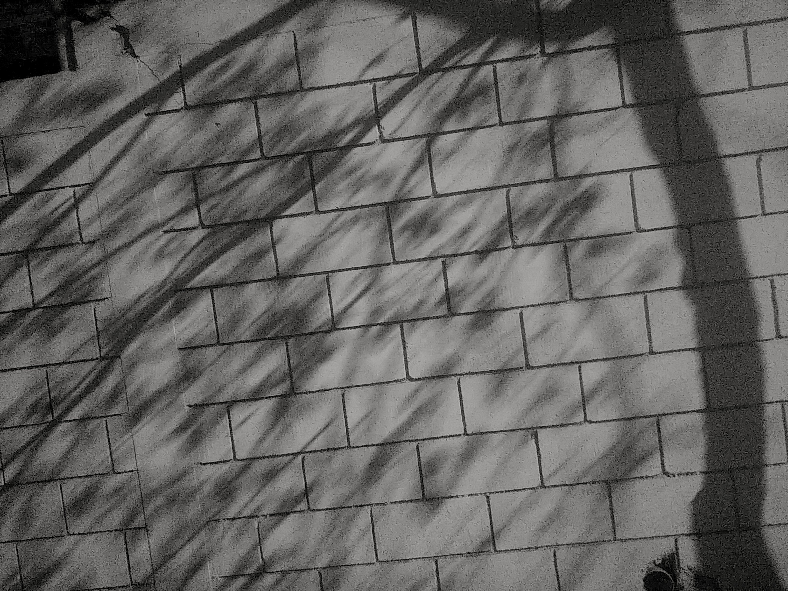

# uprising

A conversation about getting started and making up for lost time.

Whatever you do—make it gleam!

**Always on top.**

<a href="https://he-wept.github.io/1/">He Wept: Original fiction that bleeds.</a>

<a href="https://tier-one-english.github.io/entrada/">Tier One: Make English work for you.</a>

"Minimalist grunge takes the classic grunge elements and combines them with more tailored pieces, like black skinny jeans and leather jackets. While the results are still edgy, it looks more relaxed and wearable." <a href="https://reads.alibaba.com/5-best-minimalist-grunge-apparel-trends/" target="_blank">Read more.</a>

Clothes are one thing, websites quite another.

<a href="">THIS!</a>
